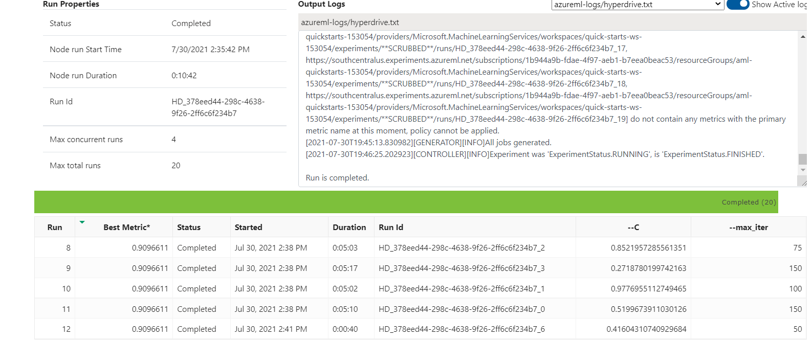
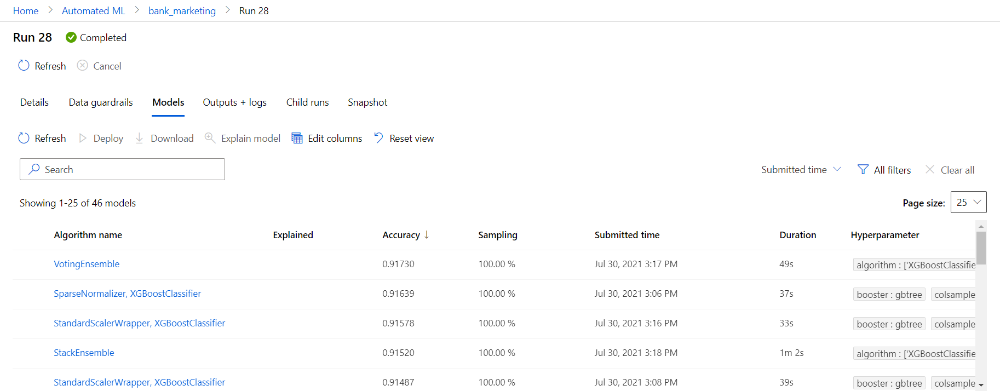

# Optimizing an ML Pipeline in Azure

## Table of contents
   * [Project Overview](#Project-Overview)
   * [Summary](#Summary)
   * [Scikit-learn Pipeline HyperDrive](#Scikit-learn-Pipeline-HyperDrive)
   * [AutoML](#AutoML)
   * [Pipeline comparison](#Pipeline-comparison)
   * [Result](#Result)
   * [Future work](#Future-work)

## Project Overview
This project is part of the Udacity Azure ML Nanodegree.
In this project, we build and optimize an Azure ML pipeline using the Python SDK and a provided Scikit-learn model.
This model is then compared to an Azure AutoML run.

## Summary

Data contains marketing data. Dataset includes data regarding campaign of bank. Problem is classification to determine whether marketing campaign is successful or not. Column y is the label, the target. 

## Scikit-learn Pipeline HyperDrive

*   ### Parameter Sampling

    We can choose one of the two parameter sampling Random or Grid. I chose random parametric sampling so that not all parameters need to be used to create all models which may blow up the resources being used or the space being used. 

* Early Stopping

    Early stopping is applied so that if the accuracy is not improved in the runs, it can stop the model and determine that the highest accuracy is the best model. We use the Bandit Policy for early stopping. 

    SKLearn from the azure python SDK is used to create estimators for training model with different parameters. 

## AutoML

AutoML creates many models and estimators to apply to the data and log the accuracy. 

AutoML creates many child runs and so to make sure that precious resources are not wasted we choose experiment timeout minutes. 

We choose task type, primary metric to optimize, column target and number of cross validations. 

```
automl_config = AutoMLConfig(
    experiment_timeout_minutes=30,
    task='classification',
    primary_metric='accuracy',
    training_data=pd.concat([x,y], axis = 1),
    label_column_name='y',
    n_cross_validations=3)
```

## Pipeline comparison

HyperDrive and AutoML gave very similar results. The difference between the two pipelines are that hyperdrive works on one model and uses the model to train and search for optimum parameters. AutoML works on applying different models to the data including scaling and normalizing, creating ensembles. 

* HyperDrive

* AutoML


## Result

HyperDrive gave 0.9096611026808296 with **LogisticRegression** and best parameters ```{"--C": 0.24537286469212533, "--max_iter": 75}``` where as AutoML gave 0.91730 with a voting Ensemble 


* Voting Ensemble model uses a Sparse Normalizer. 
```
{
    "class_name": "SparseNormalizer",
    "module": "automl.client.core.common.model_wrappers",
    "param_args": [],
    "param_kwargs": {
        "norm": "l2"
    },
    "prepared_kwargs": {},
    "spec_class": "preproc"
}
```

```
{
    "class_name": "XGBoostClassifier",
    "module": "automl.client.core.common.model_wrappers",
    "param_args": [],
    "param_kwargs": {
        "booster": "gbtree",
        "colsample_bytree": 0.7,
        "eta": 0.1,
        "max_depth": 4,
        "max_leaves": 0,
        "n_estimators": 100,
        "objective": "reg:logistic",
        "reg_alpha": 0.5208333333333334,
        "reg_lambda": 0.8333333333333334,
        "subsample": 0.6,
        "tree_method": "auto"
    },
    "prepared_kwargs": {},
    "spec_class": "sklearn"
}
```

## Future work

A lot of models are sensitive to imbalanced data and this is one similar example of that. The data can be balanced by creating synthetic data to match the number of unique points in the target using libraries like SMOTE. 

We can run the experiment for longer time and more parameters. 
